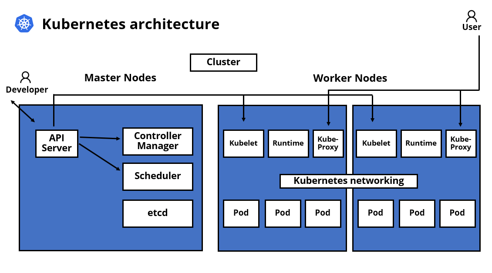

# Kubernetes architecture

In this following diagram we will understand basic architecture of Kubernetes cluster. As we know, cluster consist of multiple nodes specifically Master nodes and Worker nodes. Shortly, the master nodes are responsible for managing the cluster while the worker nodes host the workloads. 

## Let's have a close look at master and worker nodes and their components

# Master nodes

The master node is a control place that takes cares of maintaining the desired state of the cluster. It basically monitors the Kubernetes object definition and makes sure that they are scheduled on the worker nodes.

## The master node components:

* <b>API Server:</b> Exposes the Kubernetes API. It is the frontend of the control place.
* <b>Controller Manager:</b> Multiple Controllers are responsible for the overall health of the cluster
* <b>etcd:</b> A database that hosts the cluster state information.
* <b>Scheduler:</b> Responsible for placing Pods across the nodes to balance resource consumption.

# Worker nodes

A worker node can be a virtual or a physical server. Worker nodes are responsible for running containerized applications. Worker nodes are managed by the master node. Worker nodes host namely Pods, which are the most essential units of Kubernetes. These Pods can container one or more containers 

## The worker node components:

* <b>kubelet:</b> This reads the Pod specification and makes sure that the right containers run in the Pods. It interacts directly with the master node.
* <b>kube-proxy:</b> This is a network proxy running one each node. It enables the usage of services. 
* <b>Container runtime:</b> This is responsible for running containers.

We have talked about the master and worker nodes and their components. To read more about Kubernetes architecture go to:
 

* [Kubernetes components](https://kubernetes.io/docs/concepts/overview/components/)

* [Cluster architecture](https://kubernetes.io/docs/concepts/architecture/)

* [Conatiners](https://kubernetes.io/docs/concepts/containers/)

Source: PCA Google CLoud Certification Guide by KONRAD CLAPA | BRIAN GERRARD

* [Book](https://www.amazon.com/Professional-Cloud-Architect-Google-Certification/dp/1801812292)

To check more content like this follow me in:

* [YouTube](https://www.youtube.com/channel/UCPPIjmkbaopLMucC2fMs4fg)
* [Linkedin](https://www.linkedin.com/in/otabek-abdurakhmonov-46772b213/)
* [GitHub](https://github.com/otabek024)

## Thanks for following me and good luck with your study journey :)